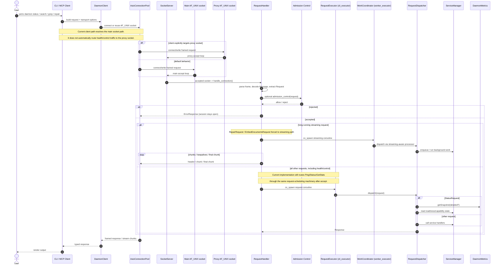
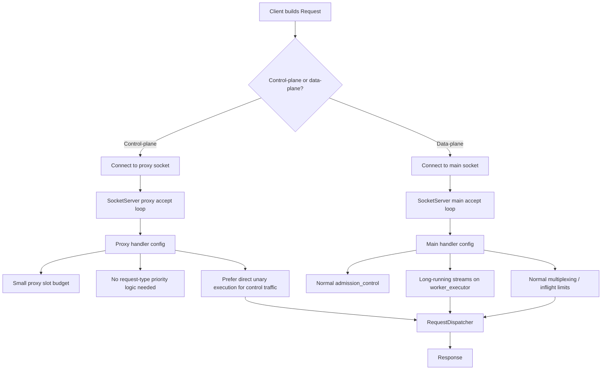

# Daemon Admission And Communication Flow

This note describes how a user request travels from the CLI/MCP client into the daemon,
where admission and slot checks happen, and which executor ends up running the request.

It intentionally distinguishes between:

- the **current implementation reality**
- the **conceptual split we may want later**

The current implementation is not a single clean pipeline. It has multiple partial "fast"
and overload-handling mechanisms at different layers, which is why the behavior feels
Frankenstein-like under load.

It is implementation-oriented and reflects the current code in:

- `src/cli/commands/daemon_command.cpp`
- `src/daemon/client/daemon_client.cpp`
- `src/daemon/client/asio_connection_pool.cpp`
- `src/daemon/components/SocketServer.cpp`
- `src/daemon/ipc/request_handler.cpp`
- `src/daemon/components/RequestDispatcher.cpp`
- `src/daemon/components/dispatcher/request_dispatcher_status.cpp`

## Current End-to-end Sequence



## Current Admission And Slot Model

```mermaid
flowchart TD
    A[Client resolves socket path] --> B{Main socket or proxy socket?}
    B -->|Default today| C[Main socket accept loop]
    B -->|Only if explicitly targeted| D[Proxy socket accept loop]

    C --> E{Accept slot policy}
    D --> F{Proxy slot policy}

    E -->|Emergency guard reject| E1[Close accepted socket and backoff]
    E -->|Accept| G[Connection registered]
    F -->|No proxy slot| F1[Close accepted socket and backoff]
    F -->|Accept| G

    G --> H[RequestHandler parses frame]
    H --> I{admission_control rejects request?}
    I -->|Yes| I1[Immediate ErrorResponse, keep session open]
    I -->|No| J{enable_multiplexing?}

    J -->|No| K[Run request inline on connection coroutine]
    J -->|Yes| L{inflight >= max_inflight_per_connection?}
    L -->|Yes| L1[Too many in-flight requests]
    L -->|No| M[Register RequestContext and increment inflight]

    M --> N{Request kind}
    N -->|Repair or EmbedDocuments| O[Spawn on worker_executor]
    N -->|Everything else, including Status/Ping/GetStats| P[Spawn on cli_executor]

    O --> Q[handle_streaming_request]
    P --> Q
    K --> Q

    Q --> R{Unary or streaming write path}
    R -->|Unary| S[write_message]
    R -->|Streaming| T[write_header + write_chunk(s)]

    S --> U[response_complete]
    T --> U
    U --> V[cleanup: inflight--, deregister context, completed++]
```

## What the diagram means

- There is already a **socket-level fast lane** in `SocketServer`:
  - main socket
  - proxy socket with separate slot handling
- There is **not** a single coherent health-request fast lane end-to-end.
- After accept, health/control requests still share most of the same request-scheduling path as
  ordinary requests.
- That layering is exactly why the system feels inconsistent under load.

## Current gate points

- **Socket accept slots**
  - `SocketServer::evaluateRequestAdmission`
  - `SocketServer::connectionSlotsFreeForLimit`
  - `SocketServer::mainSocketEmergencyGuardRejects`
  - proxy socket path has its own independent slot gate in `SocketServer::accept_loop`
- **Per-connection inflight slots**
  - `RequestHandler::handle_connection`
  - `config_.max_inflight_per_connection`
- **Protocol-level admission**
  - `RequestHandler::Config::admission_control`
  - usually wired by `SocketServer::makeHandlerConfig`
- **Executor choice**
  - current behavior: most unary requests, including `Ping`/`Status`/`GetStats`, go to
    `cli_executor`
  - long-running streams: `worker_executor`
  - there is no clean single fast-lane abstraction across client -> socket -> request handler

## Why responsiveness regresses

The communication path feels "unsnappy" when any of these happen:

- the client does not target the proxy fast lane and lands on the main socket
- health/control requests are queued behind ordinary request-pool work after accept
- long-running requests use the IPC request pool instead of the worker pool
- per-connection inflight caps reject or delay lightweight follow-up requests
- detailed status performs heavy snapshot work on the request path
- background daemon work (search build, repair, graph maintenance) saturates CPU and delays
  request coroutines even when the socket is healthy

## Why This Feels Frankenstein

There are currently multiple partial fast/overload mechanisms layered on top of each other:

1. **Socket-level split**
   - main socket
   - proxy socket
2. **Accept-time slot policies**
   - main emergency guard
   - proxy slot cap
3. **Request-time admission**
   - `admission_control` in `RequestHandler`
4. **Per-connection multiplexing slots**
   - `max_inflight_per_connection`
5. **Executor routing**
   - `cli_executor`
   - `worker_executor`

The problem is not that any single mechanism exists.
The problem is that they are spread across different layers with different ideas of what should be
fast, protected, or deprioritized.

## Practical interpretation

- The existing explicit fast lane is the **proxy socket path in `SocketServer`**.
- We should avoid inventing a second unrelated fast lane lower in the stack if we can help it.
- `RepairRequest` and `EmbedDocumentsRequest` should behave like **background streaming jobs**,
  not request-pool work.
- slot limits should protect the daemon from overload without making health checks appear dead.
- status rendering should consume **cached** metrics whenever possible.

## Cleaner Split To Aim For

To reduce complexity, the communication/admission scaffold can be thought of as four distinct
subsystems:

1. **Client transport**
   - `DaemonClient`
   - `AsioConnectionPool`
   - socket discovery / connection reuse / shutdown
2. **Socket/session layer**
   - `SocketServer`
   - accept limits, proxy socket, connection lifecycle
3. **Request scheduling**
   - `RequestHandler`
   - frame parsing, per-connection inflight slots, executor routing, streaming write path
4. **Business dispatch**
   - `RequestDispatcher`
   - service calls, status snapshots, request-specific admission and semantics

That split is useful because regressions usually belong to exactly one of those four layers.

The key cleanup rule should be:

- **Socket-level prioritization happens in `SocketServer`**
- **request semantics happen in `RequestHandler` / `RequestDispatcher`**

If health/control traffic needs priority, the cleanest version is to make the client and socket
layer use the existing proxy/control path consistently, rather than adding another ad hoc bypass
deeper in `RequestHandler`.

## What "Use The Existing Proxy Socket As The Only Fast Lane" Looks Like

The clean version is not "add another health bypass." The clean version is:

1. The client classifies requests into **control-plane** vs **data-plane**.
2. Control-plane requests go to the existing **proxy socket**.
3. Data-plane requests go to the **main socket**.
4. After accept, proxy traffic is handled with a **proxy-specific handler policy** instead of
   request-type checks spread across lower layers.

### Control-plane requests

- `PingRequest`
- `StatusRequest`
- `GetStatsRequest`
- maybe `ShutdownRequest`
- maybe `PrepareSessionRequest` if we want it to stay interactive

### Data-plane requests

- `SearchRequest`
- `GrepRequest`
- `ListRequest`
- `GetRequest` / `CatRequest`
- `AddDocumentRequest`
- `RepairRequest`
- `EmbedDocumentsRequest`
- graph / download / batch work

### Target flow



### What should disappear

If the proxy socket becomes the only fast lane, we should remove or simplify these overlaps:

- request-type-based "health" prioritization inside `RequestHandler`
- any assumption that control-plane requests should be rescued after they already entered the main
  socket/request-pool path
- duplicate admission semantics for the same class of requests at both socket and request layers

### What should stay

- **main vs proxy accept loops** in `SocketServer`
- **socket-level slot accounting** in `SocketServer`
- **streaming vs unary semantics** in `RequestHandler`
- **business logic dispatch** in `RequestDispatcher`

### The concrete code shape this implies

#### Client side

- `DaemonClient` / transport gets two socket paths:
  - `socketPath`
  - `proxySocketPath`
- request classification happens once, near request submission
- control-plane requests intentionally use the proxy socket

#### SocketServer side

- `SocketServer::makeHandlerConfig(isProxy, ...)` becomes the main policy split
- proxy socket config should be simple and explicit:
  - low slot count
  - no heavy multiplexing assumptions unless truly needed
  - no extra request-type priority logic below it

#### RequestHandler side

- should stop trying to infer its own fast lane from request type
- should mainly decide:
  - unary vs streaming
  - worker executor vs normal executor

### Why this is cleaner

With this split, there is exactly one answer to "why was this request prioritized?"

- because it went through the **proxy socket**

Not:

- because it was health traffic
- and also because `RequestHandler` special-cased it
- and also because admission control let it through
- and also because some requests happened to spawn differently

That single explanation is the main cleanup win.
