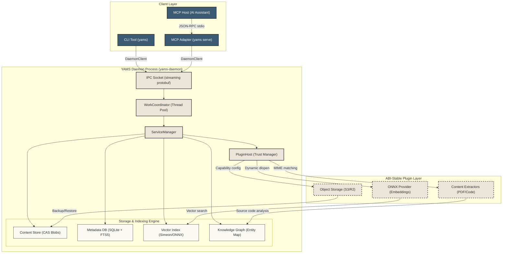

# System Architecture

YAMS is a content-addressed storage, indexing, and retrieval system. This document outlines the conceptual system layout, request lifecycle, and plugin architecture of the YAMS ecosystem.

---

## Conceptual Overview

YAMS operates on a client-daemon architecture. The core logic runs in a persistent background daemon (`yams-daemon`). The CLI talks to that daemon over low-latency IPC. AI assistants reach the daemon through the `yams serve` MCP adapter, which speaks JSON-RPC over stdio to the host and uses the daemon client internally.

---

## Key Subsystems

### 1. IPC & Concurrency

* **IPC Socket**: Multiplexes daemon client connections using a streaming protobuf protocol. The CLI and the MCP adapter both use `DaemonClient` over this socket. JSON-RPC stdio is handled one layer up by `yams serve`, not by the daemon socket itself.
* **WorkCoordinator**: Manages a hardware-adaptive thread pool. It leverages Netflix-style adaptive concurrency limiters to ensure heavy operations (like vector encoding) do not block fast read queries.

### 2. Storage & Indexing Engine

* **Content Store**: A content-addressed storage (CAS) engine. Files added to YAMS are chunked (via Rabin fingerprinting), deduplicated, compressed using `zstd`/`lzma`, and stored as content hashes (SHA-256).
* **Metadata Database**: A WAL-backed SQLite database that maps file metadata (paths, tags, collections, snapshot histories) and indexes document text for fast lexical keyword lookups (FTS5).
* **Vector Index**: Stores high-dimensional document and chunk embeddings. It supports both local lightweight lexical embeddings (Simeon) and learned dense embeddings (ONNX Runtime) using TurboQuant vector compression.
* **Knowledge Graph**: Stores code definitions, references, and hierarchical dependencies parsed during ingestion. It enables symbol-aware search and contextual ranking.

### 3. Plugin Host & Trust Manager

* **PluginHost**: Manages the dynamic loading (`dlopen`) of shared library plugins at runtime.
* **Trust Store**: Gates plugin execution via a cryptographically checked or user-approved trust manifest, preventing execution of untrusted binary extensions.

---

## Data Ingestion & Extraction Flow

When a document is ingested (e.g., via `yams add` or the MCP `add` operation), it progresses through a structured pipeline:

1. **Content Addressable Storage (CAS)**: The daemon hashes the incoming data, performs block-level deduplication, compresses it, and writes the blob to disk.
2. **Metadata Registration**: The file's path, tags, and collections are written to the metadata database.
3. **MIME Ingestion Dispatch**: The daemon identifies the file's MIME type and dispatches it to capable content extraction plugins:
   * **Source Code**: Sent to the tree-sitter symbol extractor which parses definitions (classes, functions) and populates the Knowledge Graph.
   * **Documents**: Sent to PDF/Text extractors to isolate clean text.
4. **Vector Embedding**: The extracted text is chunked, passed to the active embedding backend (Simeon/ONNX) to generate vectors, and indexed in the vector store.

---

## Search & Retrieval Fusion

YAMS uses a **hybrid search pipeline** to resolve search queries:

1. **Lexical Retrieval**: SQLite FTS5 retrieves documents matching query keywords.
2. **Semantic Retrieval**: The query is embedded, and the vector index returns nearest-neighbor chunks.
3. **Structural Retrieval**: The Knowledge Graph is traversed to extract code symbols or entities related to the query.
4. **Rank Fusion**: The results from lexical, semantic, and structural passes are combined using Reciprocal Rank Fusion (RRF) and post-processed in parallel to return the most relevant context blocks.
