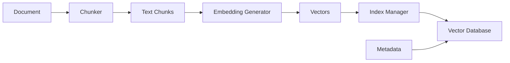
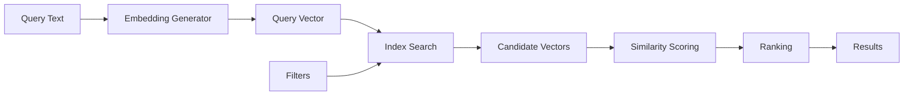

# Vector Search Architecture

## System Overview

The YAMS Vector Search system provides semantic search capabilities through a modular architecture that processes text into vector embeddings and enables similarity-based retrieval.

```
┌─────────────────────────────────────────────────────────────┐
│                     Application Layer                         │
├─────────────────────────────────────────────────────────────┤
│                    Semantic Search API                        │
├────────────┬────────────┬────────────┬────────────┬─────────┤
│  Document  │ Embedding  │   Vector   │   Model    │ Hybrid  │
│  Chunker   │ Generator  │  Database  │  Registry  │ Search  │
├────────────┴────────────┴────────────┴────────────┴─────────┤
│                    Vector Index Manager                       │
├───────────────────────────────────────────────────────────────┤
│               Storage Layer (LanceDB/Arrow)                   │
└───────────────────────────────────────────────────────────────┘
```

## Core Components

### 1. Document Chunker

Responsible for segmenting documents into semantically meaningful chunks.

**Key Features:**
- Multiple chunking strategies (sliding window, semantic, markdown-aware)
- Configurable chunk size and overlap
- Sentence boundary preservation
- Metadata preservation

**Data Flow:**
```
Document → Chunker → Text Chunks → Embedding Generator
```

### 2. Embedding Generator

Converts text into high-dimensional vector representations.

**Key Features:**
- ONNX Runtime integration
- Batch processing support
- Model-agnostic interface
- Normalization and preprocessing

**Architecture:**
```
┌──────────────┐     ┌──────────────┐     ┌──────────────┐
│   Text       │────▶│  Tokenizer   │────▶│    ONNX      │
│   Input      │     │              │     │   Runtime    │
└──────────────┘     └──────────────┘     └──────────────┘
                                                  │
                                                  ▼
                                          ┌──────────────┐
                                          │  Embedding   │
                                          │   Vector     │
                                          └──────────────┘
```

### 3. Vector Database

Persistent storage and retrieval of vector embeddings.

**Key Features:**
- LanceDB integration for columnar storage
- Apache Arrow format support
- ACID compliance
- Metadata filtering

**Schema:**
```sql
VectorTable {
    chunk_id: STRING (PRIMARY KEY)
    document_hash: STRING
    embedding: FLOAT32[]
    content: STRING
    metadata: MAP<STRING, STRING>
    model_id: STRING
    model_version: STRING
    embedding_version: INT32
    created_at: TIMESTAMP
    is_stale: BOOLEAN
}
```

### 4. Vector Index Manager

Manages different index types for efficient similarity search.

**Supported Index Types:**

| Index Type | Description | Use Case |
|------------|-------------|----------|
| FLAT | Brute force search | Small datasets (<10K) |
| HNSW | Hierarchical graph | Medium datasets (10K-1M) |
| IVF_FLAT | Inverted file index | Large datasets (>100K) |
| IVF_PQ | Product quantization | Very large datasets (>1M) |

**Index Selection Logic:**
```cpp
if (num_vectors < 10000) {
    return IndexType::FLAT;
} else if (num_vectors < 100000) {
    return IndexType::HNSW;
} else if (memory_constraint) {
    return IndexType::IVF_PQ;
} else {
    return IndexType::IVF_FLAT;
}
```

### 5. Model Registry

Manages embedding models and their lifecycle.

**Key Features:**
- Model versioning
- Performance tracking
- Compatibility matrix
- Hot-swapping support

**Model Lifecycle:**
```
Register → Load → Cache → Use → Monitor → Update/Replace
```

### 6. Hybrid Search Engine

Combines vector and keyword search for improved results.

**Architecture:**
```
┌─────────────┐     ┌─────────────┐
│   Vector    │     │   Keyword   │
│   Search    │     │    Search   │
└──────┬──────┘     └──────┬──────┘
       │                    │
       └────────┬───────────┘
                │
         ┌──────▼──────┐
         │   Result    │
         │   Fusion    │
         └──────┬──────┘
                │
         ┌──────▼──────┐
         │   Ranked    │
         │   Results   │
         └─────────────┘
```

## Data Flow

### Indexing Pipeline



1. **Document Input**: Raw documents enter the system
2. **Chunking**: Documents are split into processable chunks
3. **Embedding**: Each chunk is converted to a vector
4. **Indexing**: Vectors are added to the search index
5. **Storage**: Indexed vectors are persisted to database

### Search Pipeline



1. **Query Processing**: User query is converted to vector
2. **Index Search**: Find candidate vectors using index
3. **Scoring**: Calculate similarity scores
4. **Filtering**: Apply metadata and threshold filters
5. **Ranking**: Sort results by relevance

## Scalability Design

### Horizontal Scaling

**Sharding Strategy:**
```
Documents → Hash(doc_id) → Shard Assignment
```

**Shard Distribution:**
- Consistent hashing for balanced distribution
- Replication factor of 3 for availability
- Cross-shard query aggregation

### Vertical Scaling

**Resource Optimization:**
- Memory-mapped indices for large datasets
- Lazy loading of embeddings
- Compression with Product Quantization
- GPU acceleration for embedding generation

### Caching Strategy

**Multi-Level Cache:**
```
L1: Query Result Cache (LRU, 1GB)
L2: Embedding Cache (LFU, 4GB)
L3: Model Cache (TTL, 8GB)
```

## Performance Characteristics

### Latency Targets

| Operation | P50 | P95 | P99 |
|-----------|-----|-----|-----|
| Embedding Generation | 10ms | 25ms | 50ms |
| Vector Search (10K) | 5ms | 15ms | 30ms |
| Vector Search (1M) | 20ms | 50ms | 100ms |
| Batch Insert (100) | 50ms | 100ms | 200ms |

### Throughput Targets

- Embedding Generation: 1000 docs/sec
- Vector Search: 5000 QPS
- Index Updates: 10000 vectors/sec
- Batch Operations: 100K vectors/batch

## High Availability

### Fault Tolerance

**Component Redundancy:**
- Multiple embedding service instances
- Replicated vector indices
- Database replication
- Load balancer failover

**Recovery Mechanisms:**
```
1. Health checks every 10s
2. Automatic failover < 30s
3. Data consistency verification
4. Incremental recovery
```

### Backup Strategy

**Backup Schedule:**
- Incremental: Every hour
- Full: Daily at 02:00 UTC
- Retention: 30 days

**Backup Components:**
- Vector embeddings
- Index structures
- Model checkpoints
- Configuration

## Security Considerations

### Data Protection

- **Encryption at Rest**: AES-256 for stored vectors
- **Encryption in Transit**: TLS 1.3 for API calls
- **Access Control**: Role-based permissions
- **Audit Logging**: All operations logged

### Privacy

- **PII Handling**: Automatic redaction in logs
- **Data Retention**: Configurable TTL for vectors
- **Right to Deletion**: Support for GDPR compliance
- **Anonymization**: Hash-based document IDs

## Monitoring and Observability

### Key Metrics

**System Metrics:**
- CPU/Memory utilization
- Disk I/O rates
- Network throughput
- Queue depths

**Application Metrics:**
- Embedding generation rate
- Search latency distribution
- Index size and growth
- Cache hit rates

**Business Metrics:**
- Query volume
- Result relevance scores
- User satisfaction metrics
- API usage patterns

### Alerting Rules

```yaml
alerts:
  - name: high_search_latency
    condition: p95_latency > 100ms
    severity: warning
    
  - name: low_cache_hit_rate
    condition: cache_hit_rate < 0.7
    severity: info
    
  - name: index_corruption
    condition: index_health_check == failed
    severity: critical
```

## Integration Points

### External Systems

**Supported Integrations:**
- Elasticsearch (keyword search)
- PostgreSQL (metadata storage)
- Redis (caching layer)
- Kafka (event streaming)
- Prometheus (monitoring)

### API Interfaces

**REST API:**
```
POST /api/v1/vectors/search
POST /api/v1/vectors/index
GET  /api/v1/vectors/{id}
DELETE /api/v1/vectors/{id}
```

**gRPC API:**
```protobuf
service VectorSearch {
    rpc Search(SearchRequest) returns (SearchResponse);
    rpc Index(IndexRequest) returns (IndexResponse);
    rpc GetVector(GetRequest) returns (VectorRecord);
}
```

## Deployment Architecture

### Container Architecture

```yaml
services:
  embedding-service:
    image: kronos/embedding:latest
    replicas: 3
    resources:
      memory: 4GB
      cpu: 2
      
  vector-database:
    image: kronos/vector-db:latest
    replicas: 3
    volumes:
      - vector-data:/data
      
  index-manager:
    image: kronos/index-manager:latest
    replicas: 2
    resources:
      memory: 8GB
```

### Kubernetes Deployment

```yaml
apiVersion: apps/v1
kind: Deployment
metadata:
  name: vector-search
spec:
  replicas: 3
  template:
    spec:
      containers:
      - name: vector-search
        image: kronos/vector-search:latest
        resources:
          requests:
            memory: "4Gi"
            cpu: "2"
          limits:
            memory: "8Gi"
            cpu: "4"
```

## Future Enhancements

### Planned Features

1. **Multi-Modal Search**: Support for image and audio embeddings
2. **Cross-Lingual Search**: Multi-language support
3. **Federated Search**: Distributed search across regions
4. **AutoML**: Automatic model selection and tuning
5. **Graph Embeddings**: Knowledge graph integration

### Research Areas

- Neural architecture search for optimal models
- Quantum computing for similarity calculations
- Homomorphic encryption for private search
- Continual learning for model updates

## Appendix

### Configuration Reference

```yaml
vector_search:
  embedding:
    model: all-MiniLM-L6-v2
    dimension: 384
    batch_size: 32
    
  index:
    type: HNSW
    parameters:
      m: 16
      ef_construction: 200
      ef_search: 50
      
  database:
    path: /data/vectors
    cache_size: 4GB
    max_connections: 100
    
  search:
    default_k: 10
    max_k: 100
    similarity_threshold: 0.7
```

### Performance Tuning Matrix

| Parameter | Small Dataset | Medium Dataset | Large Dataset |
|-----------|--------------|----------------|---------------|
| Index Type | FLAT | HNSW | IVF_PQ |
| Batch Size | 16 | 32 | 64 |
| Cache Size | 1GB | 4GB | 16GB |
| Shards | 1 | 4 | 16 |
| Replicas | 1 | 2 | 3 |