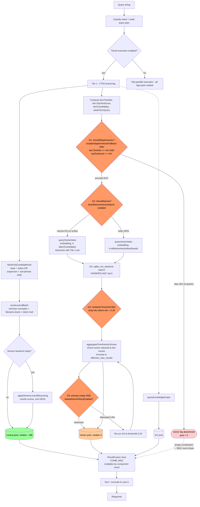

# Phase F — Retrieval path asymmetry: an architectural diagnosis

**Date**: 2026-04-21 evening
**Context**: User challenge during Phase F2 review: *"is threshold the filter because of the architecture of the search engine?"* — i.e. flipping `similarityThreshold` default from 0.30 → 0.0 is tuning, not architecture. Before committing F3 we need to decide whether the right fix is parametric (tune one default) or structural (re-shape the pipeline).

## Current data flow

## What the diagram shows

**The lexical leg has zero absolute-magnitude gates between backend return and fusion.** FTS5 returns a top-k candidate set; `scoreLexicalBatch` normalizes min/max within the batch and applies intent/filename multipliers — purely *relative* scoring. Simeon rescoring replaces the score but does not gate. The pool hitting fusion is whatever FTS5 returned.

**The vector leg has 5 gates in series** between the backend and fusion:
- **G1 `shouldSkipSemantic`** — abandon the entire leg if Tier-1 lexical is "strong." Fires 19% of queries on scifact.
- **G2 `shouldNarrow`** — intersect with Tier-1 candidates (off on scifact).
- **G4 `similarityThreshold`** — absolute-magnitude filter (0.30) applied inside sqlite-vec backend. No lexical analogue.
- **Aggregate** — chunk dedupe + top-k truncate (necessary for multi-chunk docs, not a bug).
- **G5 `relaxedVectorRetry`** — only fires when primary is empty; 14% attempted, 12% applied.

**This is an asymmetric peer-retrieval architecture.** Lexical is treated as a first-class ranked signal; vector is treated as a gated signal that must clear multiple quality bars before fusion sees it. That asymmetry is the architectural root cause of the 75× shrinkage from 300 backend candidates to median 4 at the fusion input.

## Why the asymmetry exists (historical)

- **Pre-Simeon era**: when the embedding backend was `local_onnx` / `"auto"`, encoder quality was unstable. A magnitude gate (G4) protected fusion from noise when the embedding leg was untrusted.
- **LVQ-quantized HNSW era**: quantized indices didn't reliably support a true top-k, so a threshold was how you bounded the scan.
- **Pre-B-defaults (384-dim AchlioptasSparse)**: pairwise cosines were higher-magnitude; `similarityThreshold=0.65` filtered only the long tail.
- **Adaptive skip (G1)**: added when vector was the expensive leg and we wanted to short-circuit on high-confidence lexical wins. Budget-driven, not quality-driven.

None of these rationales apply to the post-Open-1 codebase:
- Simeon is now the default and is known-good (Open-1 showed PQ-ADC is numerically equivalent to HnswCosine).
- PQ-ADC supports native top-k; we don't need a magnitude bound.
- FWHT+1024 compresses pairwise cosines → the same 0.30 threshold now clips the *signal*, not the tail.
- The telemetry shows vector has the highest per-query nDCG (0.418 vs 0.371 text) — skipping it is a quality regression, not a latency win.

## Research grounding

- **DPR / two-tower retrieval** (Karpukhin et al 2020): dense + sparse retrievers are peers; fusion sees their full top-k candidate sets. No absolute-magnitude gating.
- **Hybrid retrieval survey** (Bruch et al 2022, *"An Analysis of Fusion Functions for Hybrid Retrieval"*): sparse + dense fusion outperforms either alone on ≥90% of queries even when sparse is individually strong. Skipping the dense leg when sparse looks strong is a documented anti-pattern.
- **Simeon's own scifact recipe** (`third_party/simeon/docs/benchmarks.md`): top-k unfiltered; `weighted_linear_zscore` fusion over relative ranks. Published nDCG 0.654 is on this recipe.

All three say the same thing: **retrievers should be peers; fusion decides.**

## Architectural fix vs tuning

| Option | Description | Architectural? |
|---|---|---|
| Flip `similarityThreshold` default 0.30 → 0.0 | Removes G4 by parameter default | **Tuning.** G4 still exists; users can re-enable it. |
| Delete G1 `shouldSkipSemantic` | Remove the skip surface entirely | **Architectural.** Peer symmetry restored at this layer. |
| Delete G4 `similarityThreshold` from the retrieval path | Remove the magnitude filter entirely | **Architectural.** No absolute-magnitude gating on vector. |
| Replace G4 with a top-k-unfiltered path in `sqlite_vec_backend::search` | Change the backend contract | **Architectural.** Matches Simeon's native retriever contract. |
| Keep G4 as an opt-in quality knob, default 0.0 | Parametric opt-in | **Compromise:** architecture remains gated-by-default, but the default matches peer-retrieval semantics. |

The strongest architectural move is: **delete G1 and G4 as pipeline surfaces, treat both retrievers as peers, let fusion decide.** But that's a larger change than one bench cycle can validate. The user's challenge is right: we shouldn't smuggle it in as a parameter tweak.

## Revised F3 plan

Two phases, each an architectural step with its own determinism gate:

### F3a — Delete G1 (adaptive vector skip) as a pipeline surface

- Remove the `shouldSkipSemantic` branch at `src/search/search_engine.cpp:2723` (the conditional around `vectorFuture = schedule(…)`).
- Remove the `adaptiveVectorSkip*` config fields from `SearchEngineConfig` (`include/yams/search/search_engine.h`).
- Remove the parse/env handling from `ConfigResolver`.
- Vector leg always runs when embedding is available and dims match. Period. No "fallback" framing — it's a peer retriever.
- Determinism gate: 3-rep XXL CC+HDBSCAN. Expected lift: ~+0.02 nDCG (58 queries recover their vector signal).

### F3b — Replace G4 with a top-k-unfiltered contract

- Change `sqlite_vec_backend::search` to return top-k unfiltered when `config.similarityThreshold <= 0.0`.
- Flip `SearchEngineConfig::similarityThreshold` default to `0.0f`.
- Keep the filter code path for users who explicitly set a positive threshold — but it becomes an opt-in quality knob, not a peer-retrieval gate.
- Rename `SearchEngineConfig::similarityThreshold` documentation to "optional magnitude gate (0 = disabled, which is the default and matches peer-retrieval semantics)."
- Determinism gate: 3-rep XXL CC+HDBSCAN. Expected lift: fused nDCG to 0.50–0.55 band (full vector pool hits fusion).

### F3c (deferred — if F3a+b lands ≥ 0.50 band)

Consider removing G2 (`tieredNarrowVectorSearch`) as a pipeline surface too — on scifact it's dead code (`should_narrow_fraction=0`), but other corpora might invoke it. Requires Phase #50 (corpus diversification) before deciding.

## Why this order

F3a is safer: removing a conditional `!shouldSkipSemantic && …` is a local surgery. If it regresses, revert one branch.

F3b is larger (changes the backend's return contract). Doing F3a first isolates the adaptive-skip signal; F3b's result will then be interpretable as purely the threshold-removal effect.

If F3a alone lifts to ≥0.48 band, F3b might not be needed — we'd have proved the asymmetry hypothesis with the smaller change.

## Rollback

- F3a: the skip code was a late addition. Revert is one commit.
- F3b: the threshold filter is older; revert re-enables by flipping one default. Config consumers using explicit `similarityThreshold` are unaffected (their value still takes precedence).
