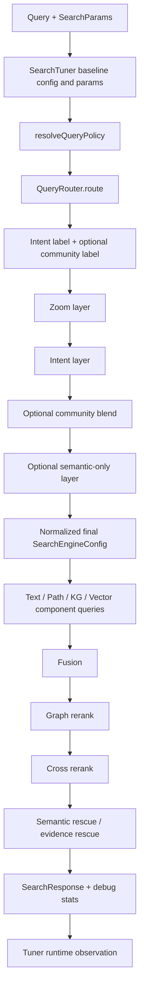

# Search Routing And Tuning Flow

This diagram captures the current search routing and tuning path after the router extraction and
policy resolver cleanup.

## Current Flow

## Important Notes

- Routing classifies labels, not numeric tuning values.
- `resolveQueryPolicy()` is the seam where corpus prior, query route, and mode overrides are
  combined.
- `queryFullText()` now consumes the already-resolved query intent instead of reclassifying.

## Next Cleanup Targets

1. Move remaining route-to-profile helpers fully out of `search_engine.cpp`.
2. Collapse compatibility telemetry paths like `community_detection` vs `query_routing`.
3. Keep the router taxonomy separate from the semantic API taxonomy.
4. Continue measuring profile behavior on long-memory corpora before changing bundle contents.
